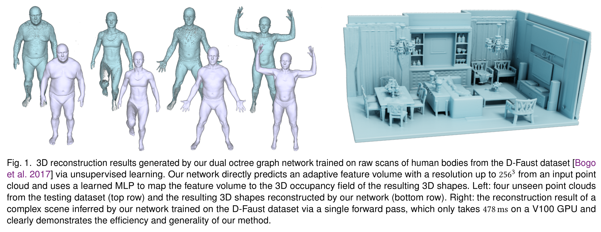

# Dual Octree Graph Networks

This repository contains the implementation of our papers *Dual Octree Graph Networks*. The experiments are conducted on Ubuntu 18.04 with 4 V400 GPUs (32GB memory). The code is released under the **MIT license**.

**[Dual Octree Graph Networks for Learning Adaptive Volumetric Shape Representations](https://arxiv.org/abs/2205.02825)**<br/>
[Peng-Shuai Wang](https://wang-ps.github.io/), [Yang Liu](https://xueyuhanlang.github.io/), and [Xin Tong](https://www.microsoft.com/en-us/research/people/xtong/) <br/>
ACM Transactions on Graphics (SIGGRAPH), 41(4), 2022




- [Dual Octree Graph Networks](#dual-octree-graph-networks)
  - [1. Installation](#1-installation)
  - [2. Shape Reconstruction with ShapeNet](#2-shape-reconstruction-with-shapenet)
    - [2.1 Data Preparation](#21-data-preparation)
    - [2.2 Experiment](#22-experiment)
    - [2.3 Generalization](#23-generalization)
  - [3. Synthetic Scene Reconstruction](#3-synthetic-scene-reconstruction)
    - [3.1 Data Preparation](#31-data-preparation)
    - [3.2 Experiment](#32-experiment)
  - [4. Unsupervised Surface Reconstruction with DFaust](#4-unsupervised-surface-reconstruction-with-dfaust)
    - [4.1 Data Preparation](#41-data-preparation)
    - [4.2 Experiment](#42-experiment)
    - [4.3 Generalization](#43-generalization)
  - [5. Autoencoder with ShapeNet](#5-autoencoder-with-shapenet)
    - [5.1 Data Preparation](#51-data-preparation)
    - [5.2 Experiment](#52-experiment)


## 1. Installation

1. Install [Conda](https://www.anaconda.com/) and create a `Conda` environment.
    ```bash
    conda create --name dualocnn python=3.7
    conda activate dualocnn
    ```

1. Install PyTorch-1.9.1 with conda according to the official documentation.
    ```bash
    conda install pytorch==1.9.1 torchvision==0.10.1 cudatoolkit=10.2 -c pytorch
    ```

2. Install `ocnn-pytorch` from [O-CNN](https://github.com/microsoft/O-CNN).
    ```bash
    git clone https://github.com/microsoft/O-CNN.git
    cd O-CNN/pytorch
    pip install -r requirements.txt
    python setup.py install --build_octree
    ```

3. Clone this repository and install other requirements.
    ```bash
    git clone https://github.com/microsoft/DualOctreeGNN.git
    cd  DualOctreeGNN
    pip install -r requirements.txt
    ```

## 2. Shape Reconstruction with ShapeNet

### 2.1 Data Preparation

1. Download `ShapeNetCore.v1.zip` (31G) from [ShapeNet](https://shapenet.org/)
   and place it into the folder `data/ShapeNet`.

2. Convert the meshes in `ShapeNetCore.v1` to signed distance fields (SDFs).

    ```bash
    python tools/shapenet.py --run convert_mesh_to_sdf
    ```

   Note that this process is relatively slow, it may take several days to finish
   converting all the meshes from ShapeNet. And for simplicity, I did not use
   multiprocessing of python to speed up. If the speed is a matter, you can
   simultaneously execute multiple python commands manually by specifying the
   `start` and `end` index of the mesh to be processed. An example is shown as
   follows:

    ```bash
    python tools/shapenet.py --run convert_mesh_to_sdf --start 10000 --end 20000
    ```

   The `ShapeNetConv.v1` contains 57k meshes. After unzipping, the total size is
   about 100G. And the total sizes of the generated SDFs and the repaired meshes
   are 450G and 90G, respectively. Please make sure your hard disk has enough
   space.

3. Sample points and ground-truth SDFs for the learning process.

    ```bash
    python tools/shapenet.py --run generate_dataset
    ```

4. If you just want to forward the pretrained network, the test point clouds
   (330M) can be downloaded manually from
   [here](https://www.dropbox.com/s/us28g6808srcop5/shapenet.test.input.zip?dl=0).
   After downloading the zip file, unzip it to the folder
   `data/ShapeNet/test.input`.

<!-- 
1. For convenience, we also provided the converted dataset, which can be
   downloaded via the following command.

    ```bash
    python tools/shapenet.py --run download_dataset
    ``` 
-->

### 2.2 Experiment

1. **Train**: Run the following command to train the network on 4 GPUs. The
   training takes 17 hours on 4 V100 GPUs. The trained weight and log can be
   downloaded [here](https://www.dropbox.com/s/v3tnopnqxoqqbvb/shapenet_weights_log.zip?dl=1).

    ```bash
    python dualocnn.py  --config configs/shapenet.yaml SOLVER.gpu 0,1,2,3
    ```

2. **Test**: Run the following command to generate the extracted meshes. It is
   also possible to specify other trained weights by replacing the parameter
   after `SOLVER.ckpt`. 

    ```bash
    python dualocnn.py --config configs/shapenet_eval.yaml  \
           SOLVER.ckpt logs/shapenet/shapenet/checkpoints/00300.model.pth
    ```

3. **Evaluate**: We use the code of
   [ConvONet](https://github.com/autonomousvision/convolutional_occupancy_networks.git)
   to compute the evaluation metrics. Following the instructions
   [here](https://github.com/wang-ps/ConvONet) to reproduce our results in Table
   1.

### 2.3 Generalization

1. **Test**: Run the following command to test the trained network on unseen 5 
   categories of ShapeNet:

    ```bash
    python dualocnn.py --config configs/shapenet_unseen5.yaml  \
           SOLVER.ckpt logs/shapenet/shapenet/checkpoints/00300.model.pth
    ```

2. **Evaluate**: Following the instructions
   [here](https://github.com/wang-ps/ConvONet) to reproduce our results on the
   unseen dataset in Table 1.

## 3. Synthetic Scene Reconstruction

### 3.1 Data Preparation

Download and unzip the synthetic scene dataset (205G in total) and the data
splitting filelists by
[ConvONet](https://github.com/autonomousvision/convolutional_occupancy_networks)
via the following command.
If needed, the ground truth meshes can be downloaded from
[here](https://s3.eu-central-1.amazonaws.com/avg-projects/convolutional_occupancy_networks/data/room_watertight_mesh.zip)
(90G).

```bash
python tools/room.py --run generate_dataset
```

### 3.2 Experiment

1. **Train**: Run the following command to train the network on 4 GPUs. The
   training takes 27 hours on 4 V100 GPUs. The trained weight and log can be
   downloaded
   [here](https://www.dropbox.com/s/t9p8e8tg9rzeaeq/room_weights_log.zip?dl=1).

    ```bash
    python dualocnn.py  --config configs/synthetic_room.yaml SOLVER.gpu 0,1,2,3
    ```

2. **Test**: Run the following command to generate the extracted meshes.

    ```bash
    python dualocnn.py --config configs/synthetic_room_eval.yaml  \
        SOLVER.ckpt logs/room/room/checkpoints/00900.model.pth
    ```

3. **Evaluate**: Following the instructions
   [here](https://github.com/wang-ps/ConvONet) to reproduce our results in Table
   5.


## 4. Unsupervised Surface Reconstruction with DFaust


### 4.1 Data Preparation

1. Download the [DFaust](https://dfaust.is.tue.mpg.de/) dataset, unzip the raw
   scans into the folder `data/dfaust/scans`, and unzip the ground-truth meshes
   into the folder `data/dfaust/mesh_gt`. Note that the ground-truth meshes are
   used in computing evaluation metric and NOT used in training.

2. Run the following command to prepare the dataset.

    ```bash
    python tools/dfaust.py --run genereate_dataset
    ```

3. For convenience, we also provide the dataset for downloading.

    ```bash
    python tools/dfaust.py --run download_dataset
    ```

### 4.2 Experiment

1. **Train**: Run the following command to train the network on 4 GPUs. The
   training takes 20 hours on 4 V100 GPUs. The trained weight and log can be
   downloaded
   [here](https://www.dropbox.com/s/lyhr9n3b7uhjul8/dfaust_weights_log.zip?dl=0).

    ```bash
    python dualocnn.py  --config configs/dfaust.yaml SOLVER.gpu 0,1,2,3
    ```


2. **Test**: Run the following command to generate the meshes with the trained
   weights.

    ```bash
    python dualocnn.py --config configs/dfaust_eval.yaml  \
           SOLVER.ckpt logs/dfaust/dfaust/checkpoints/00600.model.pth
    ```

3. **Evaluate**: To calculate the evaluation metric, we need first rescale the
   mesh into the original size, since the point clouds are scaled during the
   data processing stage.

    ```bash
    python tools/dfaust.py  \
           --mesh_folder   logs/dfaust_eval/dfaust  \
           --output_folder logs/dfaust_eval/dfaust_rescale  \
           --run rescale_mesh
    ```

    Then our results in Table 6 can be reproduced in the file `metrics.csv`.

    ```bash
    python tools/compute_metrics.py  \
           --mesh_folder logs/dfaust_eval/dfaust_rescale  \
           --filelist data/dfaust/filelist/test.txt  \
           --ref_folder data/dfaust/mesh_gt  \
           --filename_out logs/dfaust_eval/dfaust_rescale/metrics.csv
    ```


### 4.3 Generalization

In the Figure 1 and 11 of our paper, we test the generalization ability of our
network on several out-of-distribution point clouds. Please download the point
clouds from [here](https://www.dropbox.com/s/pzo9xajktaml4hh/shapes.zip?dl=1),
and place the unzipped data to the folder `data/shapes`. Then run the following
command to reproduce the results:

```bash
python dualocnn.py --config configs/shapes.yaml  \
       SOLVER.ckpt logs/dfaust/dfaust/checkpoints/00600.model.pth  \
```


## 5. Autoencoder with ShapeNet

### 5.1 Data Preparation

Following the instructions [here](#21-data-preparation) to prepare the dataset.


### 5.2 Experiment

1. **Train**: Run the following command to train the network on 4 GPUs. The
   training takes 24 hours on 4 V100 GPUs. The trained weight and log can be
   downloaded
   [here](https://www.dropbox.com/s/3e4bx3zaj0b85kd/shapenet_ae_weights_log.zip?dl=1).

    ```bash
    python dualocnn.py  --config configs/shapenet_ae.yaml SOLVER.gpu 0,1,2,3
    ```

2. **Test**: Run the following command to generate the extracted meshes. 

    ```bash
    python dualocnn.py --config configs/shapenet_ae_eval.yaml  \
           SOLVER.ckpt logs/shapenet/ae/checkpoints/00300.model.pth
    ```

3. **Evaluate**: Run the following command to evaluate the predicted meshes.
   Then our results in Table 7 can be reproduced in the file `metrics.4096.csv`.

    ```bash
    python tools/compute_metrics.py  \
           --mesh_folder logs/shapenet_eval/ae  \
           --filelist data/ShapeNet/filelist/test_im.txt \
           --ref_folder data/ShapeNet/mesh  \
           --num_samples 4096 \
           --filename_out logs/shapenet_eval/ae/metrics.4096.csv
    ```
